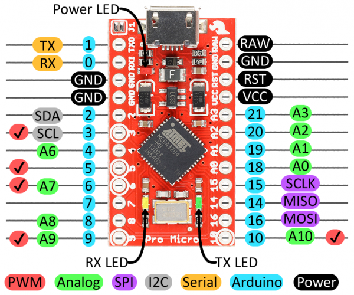

# Arduino-MIDI-Slider-Controller
A project to hook up slider pots to an Arduino to use as a MIDI controller

# Arduino Pro Micro Pinout

# MIDI Control Table
- http://www.onicos.com/staff/iz/formats/midi-cntl.html

# Install 
- Add Pro Micro to the boards manager 
- https://raw.githubusercontent.com/sparkfun/Arduino_Boards/master/IDE_Board_Manager/package_sparkfun_index.json

# Current Pinout 
- Sliders (Analog): A0, A1, A2, A3, A6
- Buttons (Digital): 5, 7
